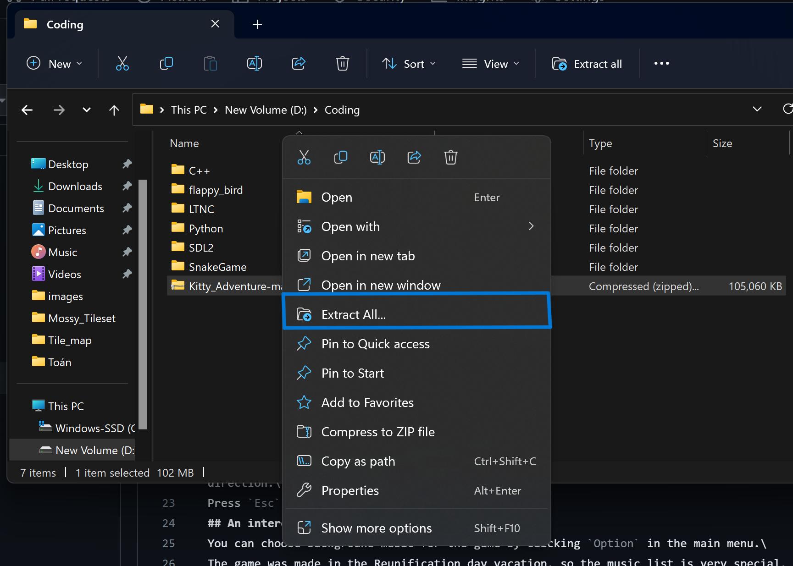

# Welcome to Kitty's adventure
## 🐱Overview
This is a simple 2D game in which you become this cute `kitty`     
    
🎇The idea of the game is very simple. 

Your mission is to run continuously and pass the obstacles as fast as possible so that the kitty stays on the screen, until it reaches the end of the map.

## 💻Technology
This game is made with `C++` and `SDL2` graphics library. 

## 🔧How to install
I have included all the necessary files in the project. So you only have to: 

1. Download this repository    
   

2. Extract

3. Run `main.exe`

Now enjoy the game !!!😻

## 🎮How to play
This is a one-button game. \
Press the `space bar` to reverse the direction of gravity, so that the kitty falls in opposite direction.\
Press `Esc` if you wanna pause the game.

## 📷How does the game look
This is the main menu screen   

Click `Options` to choose the background music      

After clicking `Play`, you can choose among 3 levels    

When you choose level, the game should start right away    

You can pause the game by pressing `Esc`     

## 😽Gratitude
I'm a newbie programmer, and this is my first complete project, so there are still many things need to be fixed and optimized.\
I'm trying my best to improve my progamming skills day by day, and create much better projects afterward.\
Thanks for your attention. If you like this cute small game, hope you can help me improve it, or give me a star so that I have more motivation to innovate the game.
